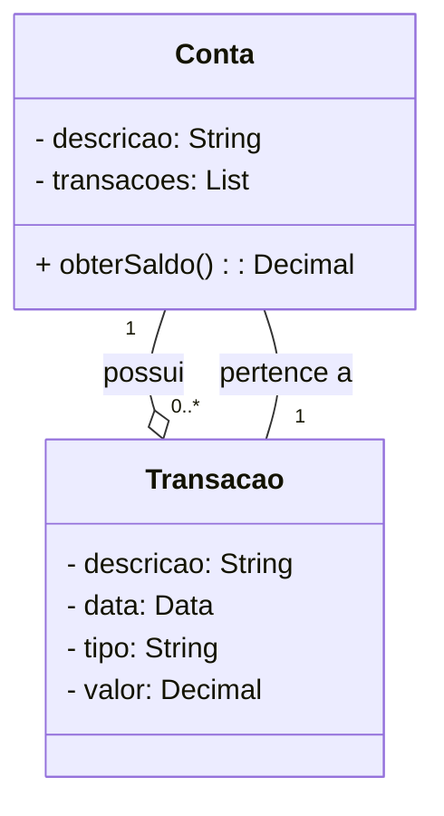

# Desafio de Projetos da Dio - Publicando Sua API REST na Nuvem Usando Spring Boot 3, Java 17 e Railway
Reposítório para o Desafio de Projetos da Dio - Publicando Sua API REST na Nuvem Usando Spring Boot 3, Java 17 e Railway

## Projeto de Referência:
https://github.com/falvojr/santander-dev-week-2023

## Domínio de Aplicação:
Elaboração de uma API para informações de Finanças Pessoais.

## Diagrama de Classes:

## Spring Boot - Bibliotecas utilizadas:
- Spring Web
- Spring Data JPA
- H2 Database
- Postgresql Drive
- Lombok
- Open API (adicionada manualmente)

## Endereço para acesso à api:
https://financas-prod.up.railway.app/swagger-ui/index.html

**OBS**: Como está sendo disponibilizado por uma plataforma de forma gratuita, esta pode não estar mais disponível.
